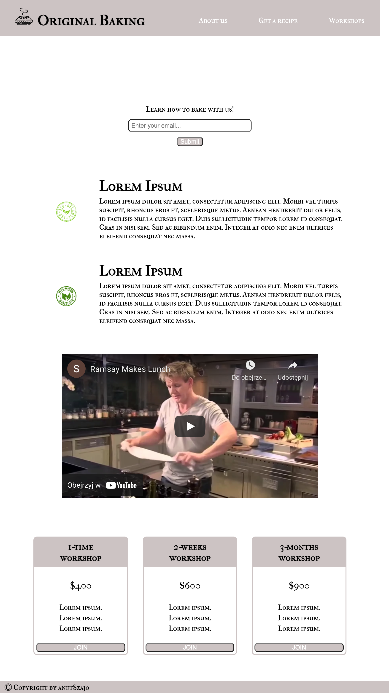
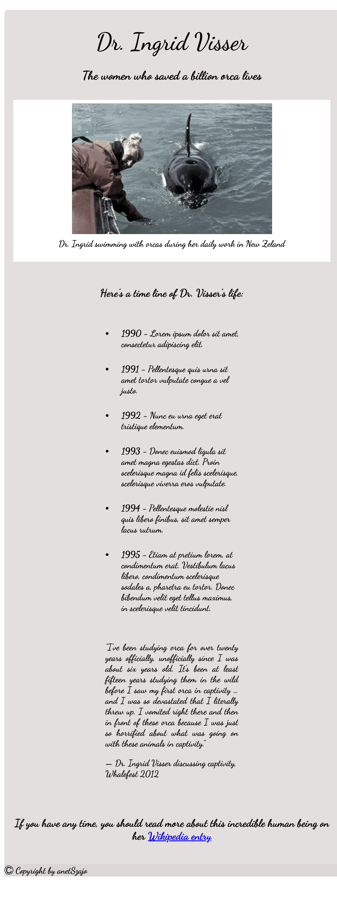
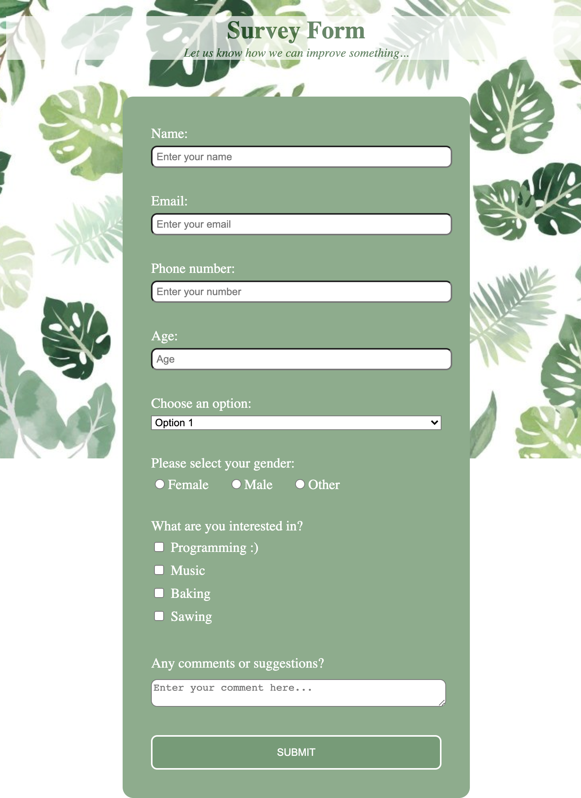
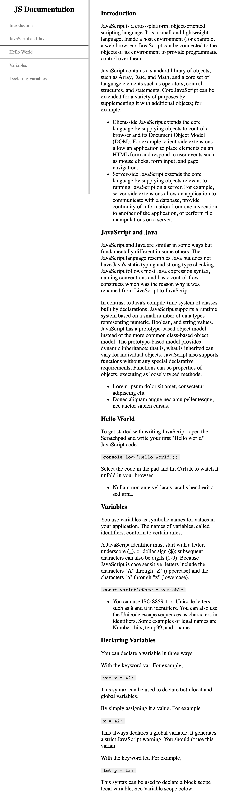
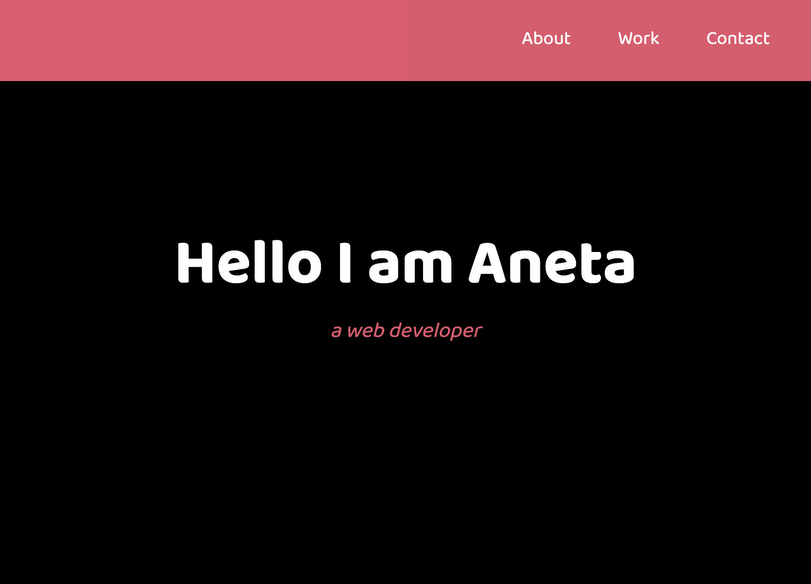
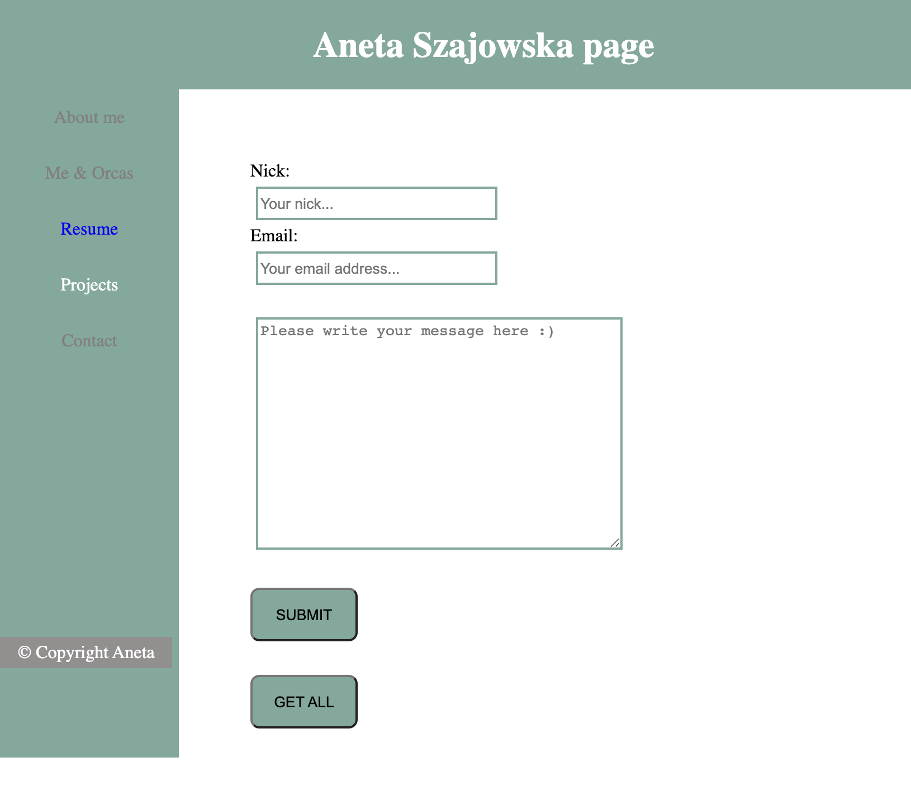
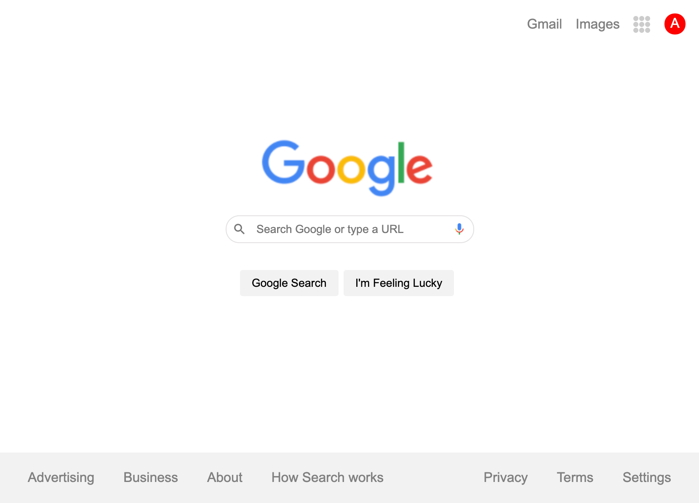

# Product Landing Page & Other HTML Projects

## Table of contents
* [General info](#general-info)
* [Technologies](#technologies)
* [Links & screenshots](#links)

## General Info
I had to start with something...These are various HTML and CSS projects thanks to which I could practice my skills at the very beginning of my programming way.
I used flex, grid and implemented RWD in all projects.
I was inspired by '7 Projects to practice HTML & CSS skills for beginners' article (https://medium.com/@avicndugu/projects-to-practice-html-css-skills-for-beginners-8b9ed67a7dd1).

## Technologies
HTML5, CSS, JavaScript
Flex, Grid, Response Web Design

##Links
* The Product Landing Page: https://landing-page.aneta.szajowska.net/ \
  
  
* The Tribute Page: https://github.com/anetSzajo/tribute-page \
  
  
* The Survey Form: https://github.com/anetSzajo/survey-form \
  
  
* The Technical Documentation Page: https://github.com/anetSzajo/technical-documentation-page \
  
  
* The Exemplary Template of Portfolio: https://github.com/anetSzajo/exemplary-personal-portfolio \
  
  
* The Exemplary Template of Personal Page: https://github.com/anetSzajo/exemplary-personal-page \
  
  
* Google Page: https://github.com/anetSzajo/google-page \
  